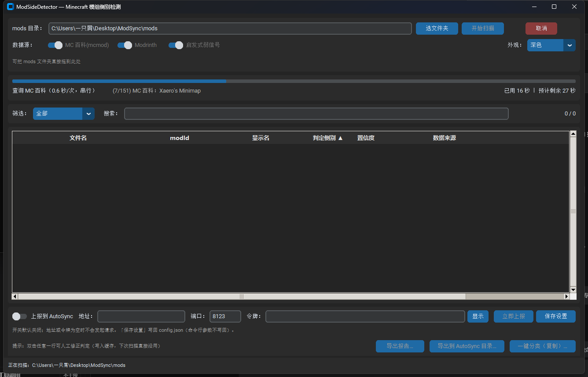

# ModSideDetector

检测 Minecraft 模组**运行侧别**的桌面工具 —— 判断每个 mod 属于 **纯客户端** / **纯服务端** / **双端**，并导出报告供 [AutoSync](https://github.com/szkele1145/AutoSync) 直接消费。

```
装多了 → 玩家白下载几百 MB
装少了 → 直接崩游戏（Missing or unsupported mandatory dependencies）
```

---

## 它解决什么问题

整合包作者手工分辨 mod 侧别极耗时且容易错。现有方案（Modrinth 的 `client_side` / `server_side`）由 **mod 作者自己填**，经常不准 —— 这正是本项目要改进的环节。

ModSideDetector 的做法是**多源交叉**：MC 百科（mcmod.cn）的「运行环境」字段 + Modrinth 的 side 字段 + jar 内静态特征，冲突时请人来定，判不了时**保守放双端**。

---

## 快速开始

### 图形界面（推荐）



> 上图是**真实运行截图**（151 个模组扫描后的结果表格）。

**不想装 Python** 的话，直接下载打包好的 Windows 版（解压后双击 `ModSideDetector.exe`）：

**[⬇ ModSideDetector-1.0.0-win64.zip](https://github.com/szkele1145/ModSideDetector/releases/latest)** —— 见 [Releases](https://github.com/szkele1145/ModSideDetector/releases)

> ⚠️ PyInstaller 打的 exe **常被杀毒软件误报**（打包器的通用现象，不是本程序的问题）。若被拦截，
> 请把**整个解压目录**加入白名单（不能只加 exe，它依赖同目录的 `_internal\`），详见下方「打包自己的 exe」。

从源码运行：

```powershell
python -m src.main                        # 打开 GUI
python -m src.main --mods-dir "D:\mc\mods"  # 打开并立即开始扫描
```

`src/main.py` 支持的参数：

| 参数 | 说明 |
|---|---|
| `--mods-dir <目录>` | 启动后直接开始扫描该目录 |
| `--version` | 打印 `ModSideDetector 1.0.0` 后退出 |
| `--self-test` | 自检：建窗口 → 渲染一帧 → 1.5 秒后自动销毁，成功退出码 0（给自动化用） |
| `--log-level DEBUG\|INFO\|WARNING\|ERROR` | 日志级别，默认 INFO |
| `--config <路径>` | 指定配置文件（默认 `<程序目录>/config.json`） |

界面功能：**选文件夹 / 拖拽文件夹**、扫描进度（进度条 + 当前文件名 + 已用时间与预计剩余）、
结果表格（**按列排序**、**按侧别筛选**、**冲突与 unknown 高亮**）、**双击行人工改判**（写入缓存）、
导出 `side-report.json/.csv/.txt`、**导出到 AutoSync 目录**、**一键分类（只复制）**、
**上报到 AutoSync（勾选开关后扫描完自动上报；可即时改地址 / 端口 / 令牌并「立即上报」）**、
底部状态栏（目录 / 各侧别计数 / 耗时 / 错误数）。

或者直接双击 `dist\ModSideDetector\ModSideDetector.exe`（免装 Python，见下方「打包」）。

界面上可以：选/拖入 `mods` 文件夹 → 看进度 → 结果表格按列排序、按侧别筛选 → **双击某行人工改判**（结论写入缓存，下次扫描直接沿用）→ 导出报告 → 一键分类。

> **拖拽是软依赖**：装了 `tkinterdnd2` 就能把文件夹直接拖进窗口，没装（或 `tkdnd`
> 二进制加载失败）时界面只是显示一行提示并禁用拖拽，其余功能完全不受影响。
> 界面底部也会说明当前是否启用。

### 命令行

```powershell
# 扫描并导出 side-report.json / .csv / .txt
python -m src scan "D:\mc\mods"

# 只跑 Modrinth（跳过 mcmod 抓取，快很多）
python -m src scan "D:\mc\mods" --no-mcmod

# 额外写一份给 AutoSync 读的文件
python -m src scan "D:\mc\mods" --for-autosync "D:\AutoSync\data"

# 扫描完直接把结果上报给 AutoSync（MSFP / 裸 TCP）
python -m src scan "D:\mc\mods" --report-to-autosync --autosync-host sync.example.com --autosync-token 你的令牌

# 人工确认某个 mod（写进缓存，永久生效）
python -m src review "D:\mc\mods" --name sodium.jar --side client --note "服主确认"

# 按报告一键分类（默认只复制，不移动原文件）
python -m src classify "D:\mc\mods" --out "D:\mc\server"

# 查看缓存统计 / 清理缓存
python -m src cache --show
python -m src cache --clear
```

> ⚠️ **全局参数要放在子命令前面**：`python -m src --verbose scan ...` 是对的，
> `python -m src scan ... --verbose` 会报 `unrecognized arguments`（argparse 的行为）。

`scan` 的常用开关：

| 开关 | 作用 |
|---|---|
| `--out-dir <目录>` | 报告输出目录（默认与 mods 目录相同） |
| `--json-only` | 只写 JSON，不写 CSV/TXT |
| `--for-autosync <目录>` | 额外写一份 AutoSync 可读的 `side-report.json` |
| `--report-to-autosync` | 扫描完成后把报告上报给 AutoSync（等价于临时打开 `autosync_report_enabled`） |
| `--autosync-host <地址>` / `--autosync-port <端口>` / `--autosync-token <令牌>` | 临时覆盖上报连接设置（**不写回 config.json**） |
| `--upload-file <路径>` | 不上报本次扫描结果，改为把指定文件（如 `side-report.json`）发给 AutoSync |
| `--limit N` | 只扫描前 N 个 jar（冒烟测试用） |
| `--no-mcmod` / `--no-modrinth` / `--no-heuristics` | 关闭对应数据源 |
| `--mcmod-scope missing` | **加速**：MC 百科只查 Modrinth 没给出结论的那些（约 1/5），151 个 mod 从 ~4.3 分钟降到 ~1 分钟；代价是放弃这部分的双源交叉验证 |
| `--offline` | 完全离线（等价于关掉 mcmod + Modrinth） |
| `--refresh` | 忽略缓存重新查询 |
| `--min-interval 1.0` | 调大 mcmod 抓取间隔（默认 0.6 秒） |

> **关于扫描速度**：MC 百科必须**串行限流 0.6 秒/请求**（HANDOFF 红线，不能用并发去压对方服务器），
> 所以首次全量扫描的耗时有下限。第二次扫描走缓存，几秒即可完成。
> 赶时间就用 `--mcmod-scope missing`，或在 GUI 里打开「mcmod 只补缺失（快）」。

---

## 判定结论怎么读

| 判定 | 含义 | 分发含义 |
|---|---|---|
| `纯客户端` | 只客户端装 | 只发给玩家 |
| `纯服务端` | 只服务端装 | 只放服务器 |
| `双端` | 两边都要 | 两边都装 |
| `不确定` | 判不了 | 按配置处理（默认当双端） |

| 置信度 | 含义 |
|---|---|
| 高 | 两源一致，或某源给出**明确依据**（如 `client_side=unsupported`） |
| 中 | 只有一个数据源有数据 |
| 低 | 两源冲突 / 无数据源 / 弱信号兜底 |

**界面上要重点看两类行**：`冲突`（两源结论相反）与 `需人工确认`。其余行扫一眼即可。

冲突时工具**不做「谁更权威」的猜测**，直接判双端并请你人工确认 —— 猜错的代价是崩游戏。唯一例外：mcmod 明写「服务端无效 / 客户端无效」（明确依据）而 Modrinth 只有弱依据时，采信 mcmod，但置信度压到低并要求复核。

详细的规则、权重与实测坑见 **[docs/判定策略.md](docs/判定策略.md)**。

---

## 数据源与实测覆盖率

在**真实数据**（151 个 NeoForge 1.21.1 模组，817 MB）上的实测：

| 数据源 | 覆盖率 | 说明 |
|---|---|---|
| **mcmod「运行环境」** | 见下方准确率章节 | 语义最清晰，**质量最高**，需限流抓取 |
| **Modrinth** | **120/151 = 79.5%** | 官方批量 API，快；但字段由作者自填，常不准 |
| jar 元数据（`clientSideOnly` / Fabric `environment`） | 约 6% | 作者显式声明，可信但覆盖率低 |
| mixin / `data/` 等启发式 | 100% | **只作提示，绝不单独定案** |
| 人工复核 | 100% | 一次性确认，写进缓存永久生效 |

**刻意不做的事**：不扫字节码。`HANDOFF.md` 实测字节码扫描准确率仅约 55%（`Axiom`、`Flashback`、`Xaero 小地图` 全被误判）。

### 验收实测

| 项目 | 实测结果 |
|---|---|
| 人工确认基准集准确率 | **70 / 70 = 100%**（样本集 `tests/known_sides.json`：69 个条目、70 次匹配） |
| **误判为纯服务端的数量** | **0** —— 铁律，由两个测试守着 |
| 全量 151 个 mod 判定分布 | 纯客户端 30 / 双端 117 / 纯服务端 4 / 不确定 0 |
| 判为纯服务端的 4 个 | BetterTab、CBC Peripheral、MiniMOTD、ServerCore（依据均为 `client_side=unsupported`，逐个核对成立） |
| Modrinth 命中率 | **120 / 151 = 79.5%** |
| 首次全量耗时（含 mcmod） | 约 4.3 分钟 —— 受串行限流 0.6 秒/请求的硬下限约束；`--mcmod-scope missing` 约 1 分钟 |
| 第二次扫描 | **0.1 秒**，报告内 `本次网络请求：0 次` |
| 单元测试 | **65 个用例全绿**（含准确率基准与铁律断言） |

复现方式：

```powershell
python -m src scan "D:\mc\mods" --out-dir out
python -m unittest tests.test_accuracy -v
```

---

## 与 AutoSync 联动

```
ModSideDetector scan → side-report.json → AutoSync 的 classify 优先读它
                                       → 读不到才回退查 Modrinth
```

`side-report.json` 的格式严格按 `HANDOFF.md` 4.2 节的约定（`generated` / `tool` / `mods[]`，每条含 `file` / `sha1` / `sha256` / `mod_id` / `display_name` / `side` / `confidence` / `sources` / `notes`）。

生成方式：

```powershell
python -m src scan "D:\mc\mods" --for-autosync "D:\AutoSync\data"
```

一键分类的输出目录名也与 AutoSync 的 `classify` 语义一致：

```
<输出目录>/
├── client-mods/     纯客户端（只发给玩家）
├── server-mods/     纯服务端（只放服务器）
└── both-mods/       双端 + 不确定（两边都要）
```

> **一键分类默认是「复制」不是「移动」**，且目标同名文件内容不同时**绝不覆盖**（只记冲突）。
> 源文件永远不动 —— 删错了没法恢复，复制错了只是浪费磁盘。

### 方式 B：网络上报（MSFP / 裸 TCP）

除了写文件，还可以在扫描完成后把同一份 `side-report.json` 内容**直接经 TCP 发给 AutoSync**，
由对方接收并存库。这条路走 **MSFP 协议**（裸 TCP，默认端口 8123，经 frp 映射到公网），
**不是 HTTP** —— AutoSync 跑在阿里云大陆节点，备案拦截系统会拦 HTTP 流量，裸 TCP 不受影响。

**默认关闭**（`autosync_report_enabled: false`），不强制使用；不打开时程序不会发起任何连接。

```jsonc
{
  "autosync_report_enabled": false,  // 开关，默认关
  "autosync_host": "",               // AutoSync 地址（域名或 IP）
  "autosync_port": 8123,             // 端口
  "autosync_token": "",              // 共享令牌（单行、不含空格）
  "autosync_timeout": 30.0           // 连接 / 读写超时（秒）
}
```

命令行（**这些开关只对本次运行生效，绝不写回 `config.json`**）：

```powershell
# 扫描完上报，连接参数临时覆盖
python -m src scan "D:\mc\mods" --report-to-autosync --autosync-host sync.example.com --autosync-port 8123 --autosync-token 你的令牌

# 只把磁盘上已有的报告发出去（不重新扫描）
python -m src scan "D:\mc\mods" --upload-file "D:\mc\mods\side-report.json" --autosync-host sync.example.com --autosync-token 你的令牌
```

成功会打印对方返回的条目数（`[ok] 上报成功：对方返回 151 条`），失败会打印原因
（令牌不对 / 对方未启用 / 超时 / 连不上 …）。**上报失败不会影响扫描结果，也不会改变 scan 的退出码。**

图形界面：底部操作区有一行「上报到 AutoSync」设置条 —— **开关**、**地址**、**端口**、
**令牌**（默认 `*` 遮罩，旁边的「显示 / 隐藏」按钮可临时看明文）、**「立即上报」**、**「保存设置」**。
「保存设置」写回 `config.json`；开关打开后，每次扫描完成都会自动上报（在后台线程里跑，不阻塞界面）。

协议一句话：连上后发 `REPORT <token> <length>\n` + `<length>` 字节的 UTF-8 JSON（`side-report.json` 全文，
长度按**字节**算），对方回一行 `OK <count>` / `ERR unauthorized` / `ERR disabled` / `ERR too large` /
`ERR bad request` / `ERR internal <detail>`。实现见 [`src/upload.py`](src/upload.py)。


---

## 打包自己的 exe

```powershell
powershell -ExecutionPolicy Bypass -File build.ps1
# 产物：dist\ModSideDetector\ModSideDetector.exe
```

脚本采用 **`--onedir`**（不是 `--onefile`）+ `--windowed`，并排除 matplotlib/numpy/PyQt 等无关大件。

> ⚠️ **杀毒软件误报**：PyInstaller 打包的 exe **经常被杀毒软件误报**，这不是本程序的问题，是打包器的通用现象。缓解办法：
> 1. 用 `--onedir`（本脚本的默认，误报率明显低于 `--onefile`）；
> 2. 把 `dist\ModSideDetector\` 整个目录加入杀软白名单（**不要只加 exe**，它依赖同目录的 `_internal\`）；
> 3. 从源码自己跑（`python -m src.main`），完全绕开打包器；
> 4. 对 exe 做代码签名（需购买证书，成本较高）。

### 打包产物里没有什么

- **不含 `cache/`** —— 里面是 mcmod.cn 抓来的内容，许可为 [BY-NC-SA 3.0](https://creativecommons.org/licenses/by-nc-sa/3.0/)，**禁止随产物分发**；
- **不含 `config.json`** —— 里面有本机路径、代理等私人配置；程序首次运行会在 exe 所在目录自动生成。

---

## 配置文件

配置优先级：`--config <路径>` > `<程序目录>/config.json` > 默认值。

首次运行会自动生成 `config.json`（GUI 会记住上次扫描的目录）。字段说明见 `config.example.json`，常用项：

| 字段 | 默认 | 说明 |
|---|---|---|
| `mods_dir` | `""` | 上次扫描的目录（自动记忆） |
| `output_dir` | `""` | 报告输出目录，空 = mods 目录 |
| `cache_dir` | `""` | 缓存目录，空 = `<程序目录>/cache` |
| `use_mcmod` / `use_modrinth` / `use_heuristics` | `true` | 数据源开关 |
| `mcmod_scope` | `"all"` | MC 百科查询范围：`all` 每个都查；`missing` 只补 Modrinth 没结论的（快，牺牲部分交叉验证） |
| `mcmod_min_interval` | `0.6` | mcmod 抓取间隔（秒），**调小会被对方限流** |
| `cache_ttl_hours` | `720` | 缓存有效期，`<=0` 表示永不过期 |
| `unknown_as` | `"both"` | 判不了时怎么办。**只接受 `both` / `unknown`**，写成 `server` 会被强制纠正 |
| `proxy` | `""` | 形如 `http://127.0.0.1:7890` |
| `autosync_report_enabled` | `false` | 扫描完自动上报给 AutoSync（默认关） |
| `autosync_host` / `autosync_port` / `autosync_token` | `""` / `8123` / `""` | AutoSync 地址、MSFP 端口与共享令牌 |

---

## 缓存与许可证（红线）

- 缓存写在 `cache/side-cache.json`，包含 jar 哈希、Modrinth 查询结果、mcmod「运行环境」原文、以及人工复核结论；
- **mcmod 的内容是 BY-NC-SA 3.0：禁止商业使用、转载需署名**。本地缓存自己用没问题，**不要把缓存打包进分发的产物**（`.gitignore` 与 `build.ps1` 都已排除）；
- mcmod 抓取**串行限流 0.6 秒/请求**，不要并发 —— 尊重对方服务器，这也是 `HANDOFF.md` 明确列出的红线。

---

## 目录结构

```
ModSideDetector/
├── README.md              本文件
├── PROMPT.md              原始需求书
├── HANDOFF.md             技术交接文档（实测结论 + 红线，勿删）
├── docs/
│   └── 判定策略.md         判定规则、置信度语义、开发阶段新发现的坑
├── config.example.json    配置示例
├── requirements.txt
├── build.ps1              PyInstaller 打包脚本
├── src/
│   ├── main.py            GUI 入口
│   ├── cli.py             命令行入口（python -m src）
│   ├── detector.py        核心编排 + 多源融合
│   ├── jarinfo.py         jar 元数据解析（TOML / Fabric / JiJ 递归 / 哈希）
│   ├── cache.py           本地缓存（含人工复核结论）
│   ├── report.py          导出 JSON / CSV / TXT + 一键分类
│   ├── net.py             urllib 封装（重试 / 代理 / 限流）
│   ├── verdict.py         判定结果枚举
│   ├── config.py, paths.py
│   ├── sources/
│   │   ├── mcmod.py       MC 百科（限流 + 多策略搜索 + 标题校验）
│   │   ├── modrinth.py    Modrinth 批量 API
│   │   └── heuristics.py  jar 内弱信号
│   └── ui/app.py          CustomTkinter 界面
└── tests/                 单元测试 + 人工确认基准集
```

---

## 开发与测试

```powershell
python -m pip install -r requirements.txt

# 单元测试（不需要网络）
python -m unittest discover -s tests -v

# 准确率基准测试（需要先生成报告）
python -m src scan "D:\mc\mods" --out-dir out
python -m unittest tests.test_accuracy -v
```

要求 **Python 3.11+**。运行期只用标准库 + `customtkinter`，网络层是标准库 `urllib`（不依赖 `requests`）。

---

## 已知限制

- **Modrinth 字段由作者自填**，可能整条都是错的；工具会在两源冲突时高亮，但**最终仍需要人工过一遍**冲突项与「需人工确认」项 —— 这是达到 100% 准确的唯一路径；
- **某些 mod 在任何数据源上都查不到**（例如作者没发布到 Modrinth、mcmod 也没收录），此时只能保守判双端；
- **mcmod 新收录条目可能没有「运行环境」字段**：这是「字段缺失」，不等于「无侧别信息」，工具会退回其它数据源；
- 首次全量扫描需要抓 mcmod，**耗时与 mod 数量成正比**（限流 0.6 秒/请求，151 个 mod 约 2–3 分钟）；第二次扫描走缓存，几秒完成；
- **exe 没有自带控制台**：`ModSideDetector.exe --version` / `--self-test` 会先尝试写 fd 1（输出被重定向到管道/文件时有效），失败再附着父控制台，并把控制台代码页临时切到 65001（退出时还原）。在**极少数终端组合**下这行文字仍可能看不到 —— 但退出码始终可信（`--self-test` 成功即 0）；
- 拖拽依赖 `tkinterdnd2`：未安装或 `tkdnd` 二进制加载失败时，界面上会显示提示并禁用拖拽，其它功能不受影响（软依赖，不阻塞启动）。

---

## 红线（摘自 HANDOFF.md，务必遵守）

- ❌ 不要把 mcmod 抓来的数据打包进分发的产物（BY-NC-SA 3.0）
- ❌ 不要并发狂抓 mcmod（限流 0.6 秒/请求）
- ❌ 不要用字节码扫描做主判据（实测准确率仅约 55%）
- ❌ 不要把「不确定」判成 `server`（代价是客户端缺 mod 崩游戏）
- ❌ 不要重写 AutoSync 已有的 TOML / JiJ 解析

## 许可证

本项目管理器代码采用 MIT（见 [LICENSE](LICENSE)）。
**注意**：mcmod.cn 的内容为 BY-NC-SA 3.0，与本项目的 MIT 许可无关，不要混淆。

---

## 在线文档

文档站（深色科技风、纯静态、**无任何外部 CDN 依赖**，离线也能打开）：

**https://szkele1145.github.io/ModSideDetector/**

| 页面 | 内容 | 内容来源 |
|---|---|---|
| [首页](https://szkele1145.github.io/ModSideDetector/) | 项目定位、核心特性、判定结论与数据源一览 | 手写（由生成器输出） |
| [使用指南](https://szkele1145.github.io/ModSideDetector/guide.html) | 本 README 的网页版 | `README.md` |
| [判定策略](https://szkele1145.github.io/ModSideDetector/strategy.html) | 判定枚举、数据源权重、融合规则与新踩的坑 | `docs/判定策略.md` |
| [技术交接](https://szkele1145.github.io/ModSideDetector/handoff.html) | 全部实测结论、可复用片段与红线 | `HANDOFF.md` |
| [原始需求书](https://szkele1145.github.io/ModSideDetector/prompt.html) | 最初的开发提示词与验收标准 | `PROMPT.md` |

站点由 `python tools/build_site.py` 生成（`--check` 只校验不写文件），产物为 `docs/*.html` + `docs/assets/`，随 `main` 分支的 `/docs` 目录发布。

> ⚠️ `docs/判定策略.md` 是文档**源文件**，必须保留 —— 不要因为它生成了 `strategy.html` 就把它删掉。

---

## 制作

**本项目由 DeepSeek-V4.1-Flash 制作。**

发布方式（GitHub Pages 手动配置，**不使用 Actions**）见 [docs/README-PAGES.md](docs/README-PAGES.md)。
